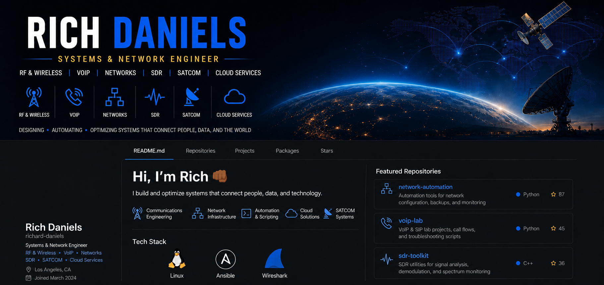
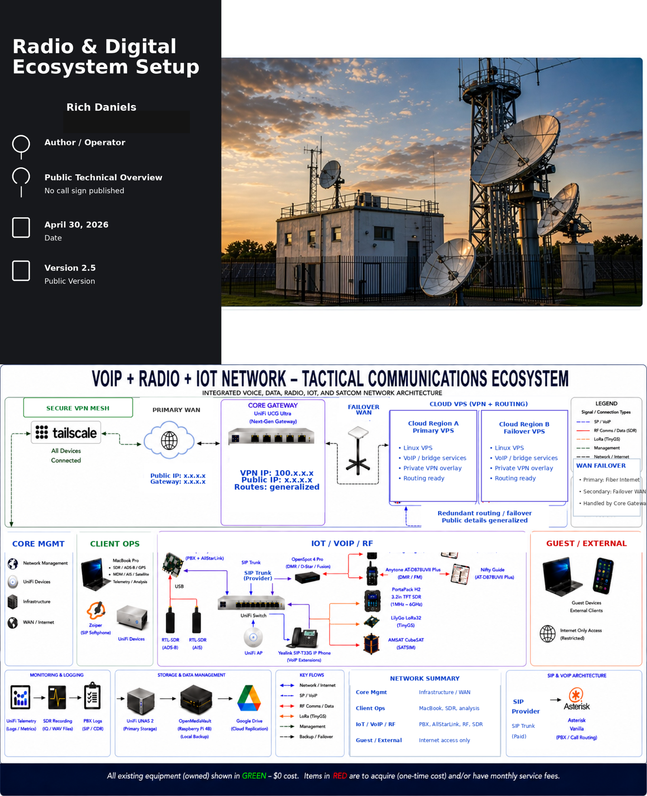

  

<h2 align="center">Hi, I’m Rich 👊🏾</h2>

<h3 align="center">Rich Daniels</h3>

Systems / Network Engineer | RF • VoIP • SDR • Cloud

**Systems / Network Engineer**  
Hybrid Communications Systems | RF • VoIP • SDR • Cloud • SATCOM • Networks 

---

## 🚀 About Me

I design and build hybrid communications systems that integrate:

- RF (DMR / Analog / Digital Voice)
- SATCOM (Protected Military + Commercial)
- VoIP (SIP-based telephony)
- SDR (ADS-B, AIS, telemetry)
- Cloud infrastructure
- Secure overlay networking

Focused on **resilient architecture, interoperability, and real-world validation**.

---

## 🔧 Featured Project

### Hybrid Communications System
Public technical overview of a fully integrated RF + VoIP + SDR + cloud architecture.

👉 [View Live Project](https://richard-daniels.github.io/hybrid-comms-system/)  
👉 [View Source Repo](https://github.com/richard-daniels/hybrid-comms-system)

## Why This Project Matters

Modern communications systems require integration across RF, IP networks, and cloud infrastructure.  
This project demonstrates real-world design, validation, and interoperability across these domains.

---

## 📊 Core Skills

- Network Architecture & Design
- RF / VoIP Integration
- SDR Systems & Telemetry
- VPN / Overlay Networking
- Cloud Infrastructure & Failover
- Systems Validation & Testing

---

## 🎯 Interests

- Mission-critical communications
- Space / satellite systems
- Secure network operations
- Distributed system design

---

## 📫 Contact

- GitHub: https://github.com/richard-daniels

---
